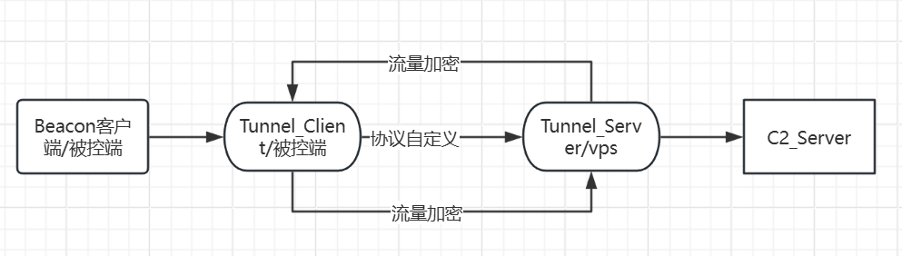
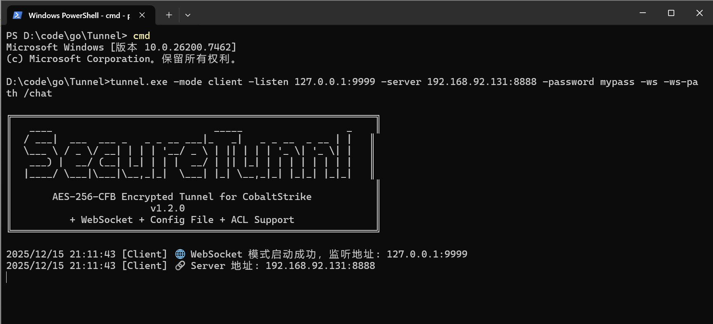
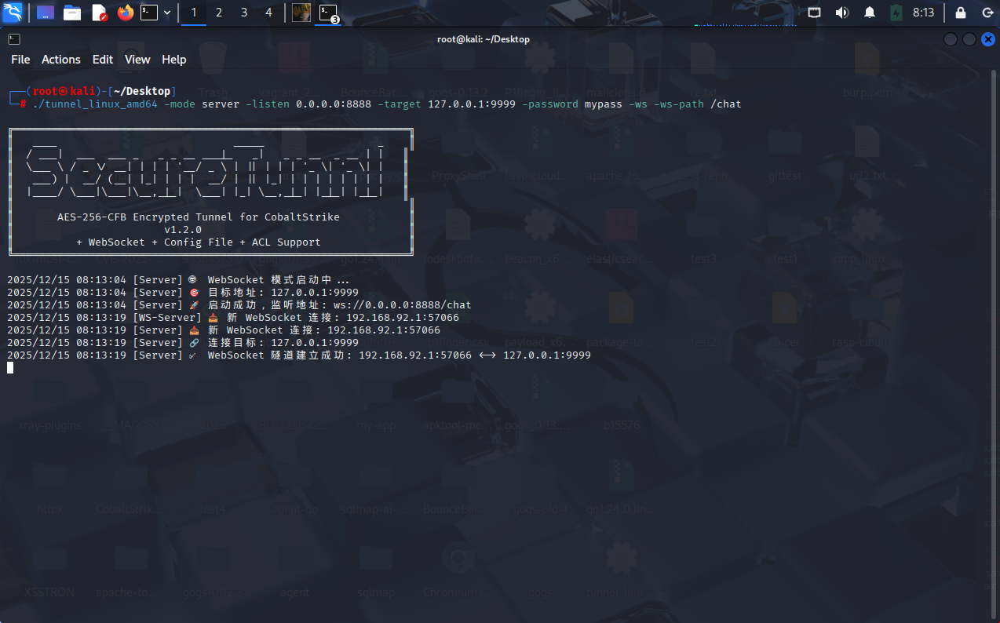
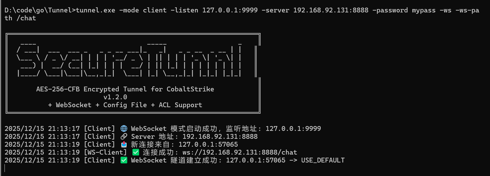
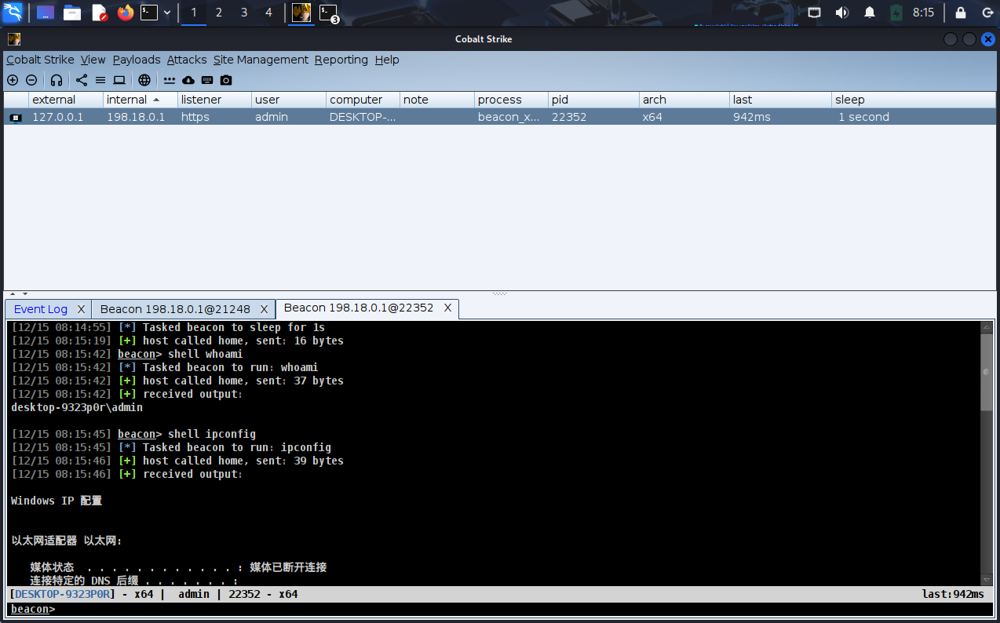
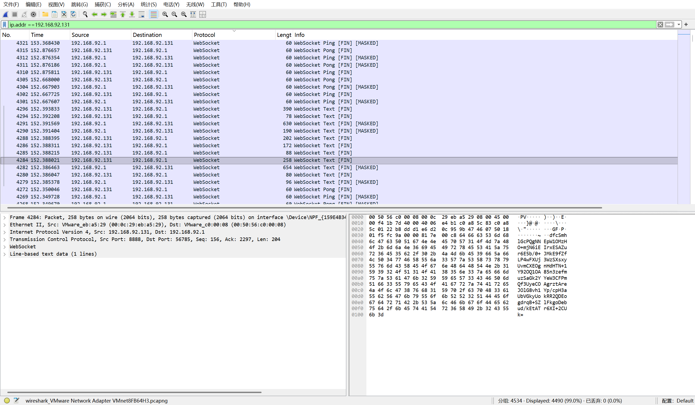

# SecureTunnel - AES-256-CFB 加密隧道

> 一个基于 Go 语言的安全隧道工具，专为 CobaltStrike 等 C2 框架设计，提供 AES-256-CFB 加密传输。

---

## 📋 目录

- [功能特点](#-功能特点)
- [架构设计](#-架构设计)
- [快速开始](#-快速开始)
- [使用示例](#-使用示例)
- [配置说明](#-配置说明)
- [参数列表](#-参数列表)
- [项目结构](#-项目结构)
- [安全说明](#️-安全说明)

---

## ✨ v1.2.0 新功能

- 📄 **配置文件支持** - 支持 YAML/JSON 配置文件，启动后可自动删除
- 🛡️ **IP 黑白名单** - Server 端支持 IP/CIDR 访问控制
- 🔒 **安全删除** - 配置文件覆写后删除，防止恢复

---

## 📋 功能特点

- **🔐 AES-256-CFB 加密** - 所有传输数据均经过 AES-256-CFB 加密
- **🔄 双向加密** - 请求和响应均加密传输
- **🌐 HTTPS CONNECT 代理** - 支持 HTTP/HTTPS CONNECT 代理模式
- **📡 WebSocket 传输** - 支持 WS/WSS 协议，流量更隐蔽
- **📄 配置文件** - 支持 YAML/JSON 配置，启动后自动删除
- **🛡️ 访问控制** - Server 端支持 IP 黑白名单
- **⚡ 高并发** - 基于 Go 协程，支持大量并发连接
- **🌍 跨平台** - 支持 Windows、Linux、macOS

---

## 🏗️ 架构设计



**工作流程：**

1. Owner Client (Beacon) 连接到本地 Proxy Client
2. Proxy Client 将流量加密后转发到 Proxy Server (VPS)
3. Proxy Server 解密后转发到 Owner Server (TeamServer)
4. 响应数据按相反方向加密传输

---

## 🚀 快速开始

### 编译项目

```bash
# 使用构建脚本（推荐）
# Windows:
build.bat

# Linux/macOS:
./build.sh

# 手动编译 Server
go build -ldflags="-s -w" -o tunnel-server.exe ./cmd/server

# 手动编译 Client
go build -ldflags="-s -w" -o tunnel-client.exe ./cmd/client

# 交叉编译 Linux
GOOS=linux GOARCH=amd64 go build -ldflags="-s -w" -o tunnel-server_linux ./cmd/server
GOOS=linux GOARCH=amd64 go build -ldflags="-s -w" -o tunnel-client_linux ./cmd/client
```

### 快速启动

**Server 端：**
```bash
./tunnel-server -listen 0.0.0.0:8888 -target 127.0.0.1:50050 -password "YourPass"
```

**Client 端：**
```bash
./tunnel-client -listen 127.0.0.1:443 -server vps.example.com:8888 -password "YourPass"
```

---

## 📖 使用示例

### 场景：CobaltStrike 隧道配置

#### 1. CobaltStrike 监听器配置

在 CobaltStrike 中创建 HTTP 监听器，配置为本地地址：

```
监听地址: 127.0.0.1:9999
```



#### 2. Client 端配置

启动 Client 端，监听本地 443 端口，连接到 VPS 的 Server：

```bash
./tunnel-client -listen 127.0.0.1:443 -server vps.example.com:8888 -password "YourPass" -ws
```



#### 3. Server 端配置

在 VPS 上启动 Server 端，监听 8888 端口，转发到本地 TeamServer：

```bash
./tunnel-server -listen 0.0.0.0:8888 -target 127.0.0.1:50050 -password "YourPass" -ws
```



#### 4. 流量分析

**网络流量侧：** 所有流量均为 WebSocket 协议，与 CobaltStrike 原始流量完全无关，有效规避流量检测。



**CobaltStrike 侧：** 功能一切正常，Beacon 正常上线，所有功能均可正常使用。



---

## 📄 配置说明

### 配置文件模式

#### 生成示例配置

```bash
# Server 端生成配置
tunnel-server -gen-config server.yaml

# Client 端生成配置
tunnel-client -gen-config client.yaml
```

#### 使用配置文件启动

```bash
# 普通启动
tunnel-server -config server.yaml
tunnel-client -config client.yaml

# 启动后删除配置文件
tunnel-server -config server.yaml -delete-config
tunnel-client -config client.yaml -delete-config

# 安全删除配置文件（覆写后删除，防止数据恢复）
tunnel-server -config server.yaml -secure-delete
tunnel-client -config client.yaml -secure-delete
```

#### 配置文件示例

**Server 配置 (server.yaml):**

```yaml
mode: server

server:
  listen: "0.0.0.0:8888"
  target: "127.0.0.1:50050"
  password: "YourSecurePassword@2024"
  
  # WebSocket 配置
  enable_ws: false
  ws_path: "/ws"
  ws_tls: false
  ws_cert: ""
  ws_key: ""
  
  # 访问控制
  acl:
    enable: true
    mode: "whitelist"  # whitelist 或 blacklist
    whitelist:
      - "192.168.1.0/24"
      - "10.0.0.0/8"
      - "127.0.0.1"
    blacklist:
      - "192.168.1.100"
```

**Client 配置 (client.yaml):**

```yaml
mode: client

client:
  listen: "127.0.0.1:443"
  server: "vps.example.com:8888"
  password: "YourSecurePassword@2024"
  enable_https: false
  
  # WebSocket 配置
  enable_ws: false
  ws_path: "/ws"
  ws_tls: false
  ws_skip_verify: false
```

---

## 🛡️ IP 访问控制 (ACL)

Server 端支持基于 IP 的访问控制，支持白名单和黑名单两种模式。

### 白名单模式

只允许名单内的 IP 连接：

```bash
tunnel-server -listen 0.0.0.0:8888 -target 127.0.0.1:50050 -password mypass \
  -acl -acl-mode whitelist -acl-whitelist "192.168.1.0/24,10.0.0.1,127.0.0.1"
```

### 黑名单模式

拒绝名单内的 IP 连接：

```bash
tunnel-server -listen 0.0.0.0:8888 -target 127.0.0.1:50050 -password mypass \
  -acl -acl-mode blacklist -acl-blacklist "192.168.1.100,10.10.0.0/16"
```

### 支持的格式

- **单个 IP**: `192.168.1.100`
- **CIDR 格式**: `192.168.1.0/24`
- **多个条目**: 用逗号分隔，如 `"192.168.1.0/24,10.0.0.1,127.0.0.1"`

---

## 📡 传输模式

### TCP 模式（传统加密隧道）

**Server 端：**
```bash
./tunnel-server -listen 0.0.0.0:8888 -target 127.0.0.1:50050 -password "YourPass"
```

**Client 端：**
```bash
./tunnel-client -listen 127.0.0.1:443 -server vps.example.com:8888 -password "YourPass"
```

### WebSocket 模式（流量伪装）

**Server 端：**
```bash
# 基础 WebSocket
./tunnel-server -listen 0.0.0.0:80 -target 127.0.0.1:50050 -password "YourPass" \
  -ws -ws-path /api/stream

# WebSocket + TLS
./tunnel-server -listen 0.0.0.0:443 -target 127.0.0.1:50050 -password "YourPass" \
  -ws -ws-tls -ws-cert cert.pem -ws-key key.pem
```

**Client 端：**
```bash
# 基础 WebSocket
./tunnel-client -listen 127.0.0.1:443 -server vps.com:80 -password "YourPass" \
  -ws -ws-path /api/stream

# WebSocket + TLS
./tunnel-client -listen 127.0.0.1:443 -server vps.com:443 -password "YourPass" \
  -ws -ws-tls -ws-skip-verify
```

### HTTPS CONNECT 代理模式

Client 端支持 HTTPS CONNECT 代理模式：

```bash
./tunnel-client -listen 127.0.0.1:443 -server vps.example.com:8888 \
  -password "YourPass" -https
```

---

## 📖 参数列表

### Server 参数 (tunnel-server)

| 参数 | 说明 | 默认值 | 必需 |
|------|------|--------|------|
| `-listen` | 监听地址 | - | ✅ |
| `-target` | 目标地址 (如 TeamServer) | - | ✅ |
| `-password` | 加密密码 | SecureTunnel@2024 | ❌ |

### Client 参数 (tunnel-client)

| 参数 | 说明 | 默认值 | 必需 |
|------|------|--------|------|
| `-listen` | 本地监听地址 | - | ✅ |
| `-server` | Server 端地址 | - | ✅ |
| `-target` | 目标地址 (可选) | - | ❌ |
| `-password` | 加密密码 | SecureTunnel@2024 | ❌ |
| `-https` | 启用 HTTPS CONNECT 代理 | false | ❌ |

### 配置文件参数

| 参数 | 说明 |
|------|------|
| `-config` | 配置文件路径 (JSON/YAML) |
| `-gen-config` | 生成示例配置文件 |
| `-delete-config` | 启动后删除配置文件 |
| `-secure-delete` | 安全删除 (覆写后删除) |

### WebSocket 参数

| 参数 | 说明 | 默认值 |
|------|------|--------|
| `-ws` | 启用 WebSocket | false |
| `-ws-path` | WebSocket 路径 | /ws |
| `-ws-tls` | 启用 TLS | false |
| `-ws-cert` | TLS 证书路径 | - |
| `-ws-key` | TLS 密钥路径 | - |
| `-ws-skip-verify` | 跳过证书验证 (Client) | false |

### ACL 参数 (Server)

| 参数 | 说明 | 默认值 |
|------|------|--------|
| `-acl` | 启用访问控制 | false |
| `-acl-mode` | 模式 (whitelist/blacklist) | whitelist |
| `-acl-whitelist` | 白名单 (逗号分隔) | - |
| `-acl-blacklist` | 黑名单 (逗号分隔) | - |

---

## 🛡️ 安全说明

### 加密安全

- ✅ **强密码建议** - 请使用强密码（建议 16+ 字符，包含大小写字母、数字和特殊字符）
- ✅ **密钥派生** - 密码通过 SHA-256 哈希转换为 32 字节 AES 密钥
- ✅ **随机 IV** - 每个数据包使用随机 IV，确保相同明文产生不同密文
- ✅ **AES-256-CFB** - 使用 AES-256-CFB 模式，提供强加密保护

### 配置安全

- ✅ **安全删除** - 使用 `-secure-delete` 参数可覆写后删除配置文件，防止数据恢复
- ✅ **自动删除** - 使用 `-delete-config` 参数可在启动后自动删除配置文件
- ✅ **访问控制** - 建议启用 ACL 限制访问来源，只允许信任的 IP 连接

### 最佳实践

1. **密码管理**
   - 使用强密码，定期更换
   - 不要在代码或配置文件中硬编码密码
   - 使用配置文件时，启动后立即删除

2. **网络隔离**
   - Server 端启用 ACL 白名单模式
   - 限制 Server 端监听地址，避免暴露在公网
   - 使用防火墙规则进一步限制访问

3. **传输安全**
   - 生产环境建议使用 WebSocket + TLS (WSS)
   - 定期更新 TLS 证书
   - 避免使用自签名证书（如必须，确保证书安全）

4. **日志安全**
   - 注意日志中可能包含敏感信息
   - 定期清理日志文件
   - 避免在日志中记录密码等敏感信息

---

**⚠️ 免责声明：** 本工具仅供安全研究和合法授权测试使用。使用者需自行承担使用本工具所产生的所有法律责任。
